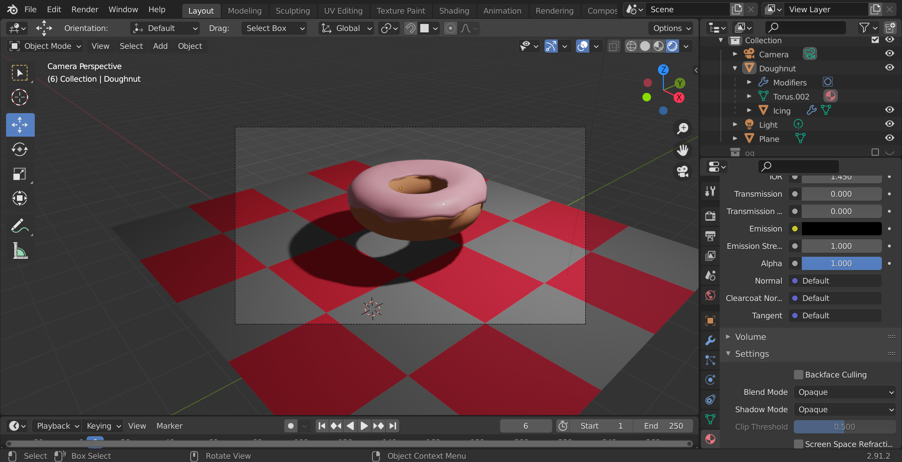
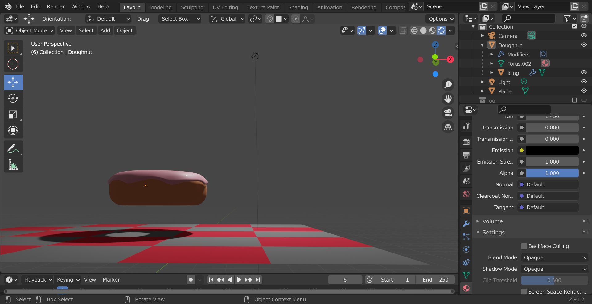

## Challenge
**Create a 3D model**: Three-Dimensional models are important across many different industries

## Demo:
- Software used: Blender
- Description: 3D model of a doughnut with pink icing on a checkered plane

 

